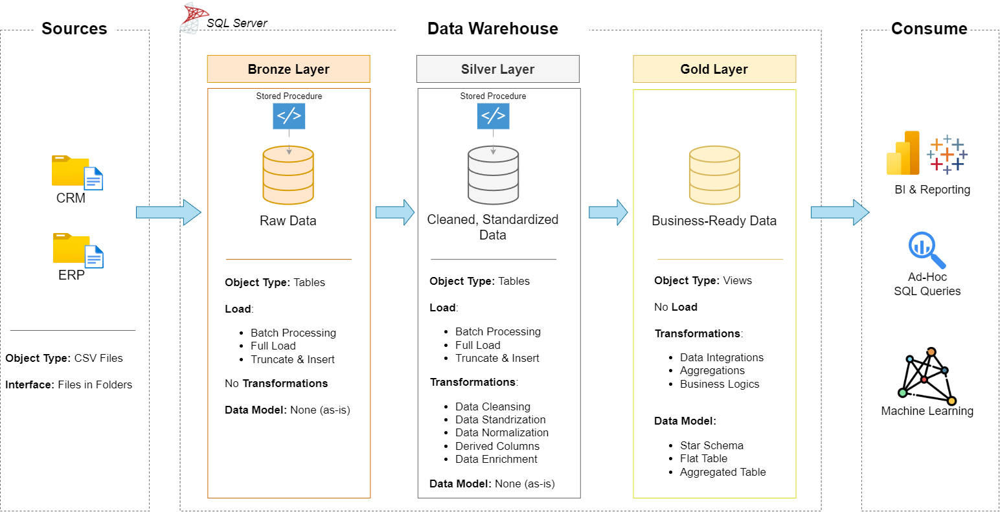
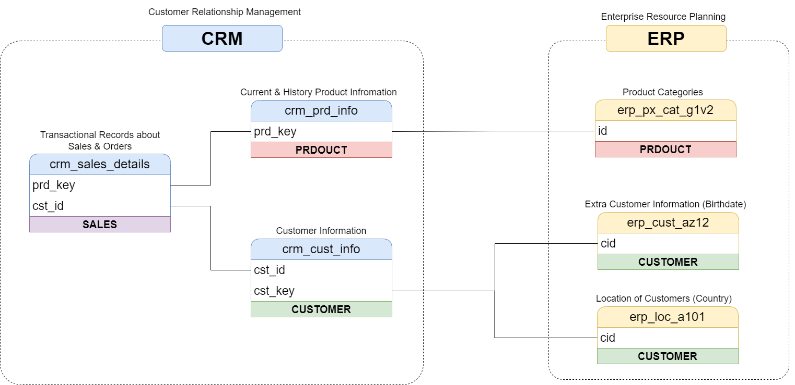

# Enterprise Retail Data Solution

This project demonstrates a complete data warehousing pipeline and further analysis for an enterprise retail environment using a star schema model. It includes data integration from CRM and ERP sources, transformation through Bronze and Silver layers, and final curation in the Gold layer for analytics. SQL is used for schema creation, data loading, cleaning, and reporting.

## 🔧 Tech Stack

- SQL (PostgreSQL / MySQL compatible). This project uis done with SQL Server
- Data Warehouse Architecture (Bronze, Silver, Gold layers)
- Star Schema Modeling

---

## 📁 Project Structure

```
Enterprise-Retail-Data-Solution/
│
├── Analytics/
│   ├── datasets/                      # Extracted from Gold layer views
│   │   ├── gold.dim_customers.csv
│   │   ├── gold.dim_products.csv
│   │   └── gold.fact_sales.csv
│   |
│   └── scripts/
│       ├── init_database.sql
│       ├── report_customers.sql
│       ├── report_products.sql
│       └── summary_reports.sql
│
├── DataWarehouse/
│   ├── datasets/
│   │   ├── source_crm/
│   │   │   ├── cust_info.csv
│   │   │   ├── prd.info.csv
│   │   │   └── sales_details.csv
│   │   └── source_erp/
│   │       ├── CUST_AZ12.csv
│   │       ├── LOC_A101.csv
│   │       └── PX_CAT_G1V2.csv
│   ├── docs/
│   │   ├── data_architecture.png
│   │   └── data_integration.png
│   ├── scripts/
│   │   ├── bronze/
│   │   │   ├── ddl_bronze.sql
│   │   │   └── load_bronze.sql
│   │   ├── silver/
│   │   │   ├── ddl_silver.sql
│   │   │   └── load_silver.sql
│   │   └── gold/
│   │       └── ddl_gold.sql
│   └── test/
│       └── quality_checks_silver.sql
```

---

## 🧱 Layers Explanation

### 🔹 Bronze Layer (Raw)
- Stores raw unprocessed data from CRM and ERP sources.
- Files are ingested as-is into the database.

### ⚪ Silver Layer (Cleaned)
- Applies cleaning, standardization, and column transformation logic.
- Data is modeled and structured for analytical use.

### 🟡 Gold Layer (Curated)
- Optimized dimensional tables using a star schema for analytics.
- Dimensional modeling: `dim_customers`, `dim_products`, `fact_sales`.

---

## 📊 Analytics Overview

Analytics SQL queries are run over the gold layer to generate:
- Customer segmentation and demographics reports.
- Product category and subcategory performance.
- Overall sales performance across time, geography, and product lines.

---

## 📊 Data Architecture



## 🔗 Data Integration



---

## 📌 Key Scripts

- `ddl_*.sql`: Create schemas for bronze, silver, gold.
- `load_*.sql`: Load data into layers (staging → clean → curated).
- `report_*.sql`: SQL-based analytics for business questions.
- `quality_checks_silver.sql`: Ensures data quality before progressing to gold.

---

## 🚀 Future Scope & Improvements

While the current implementation focuses on building a robust data warehouse and performing SQL-based analytics, there are several areas identified for future enhancements:

- **Building Predictive Models:**  
  Integrating machine learning models for predictive analytics such as forecasting future sales or customer segmentation.  
  *(Currently not implemented due to data insufficiency.)*

- **Creating Visual Dashboards:**  
  Developing interactive dashboards using tools like Power BI or Tableau for enhanced data storytelling.  
  *(Currently not implemented due to data insufficiency.)*

---

## 🧾 License

This project is under MIT License
